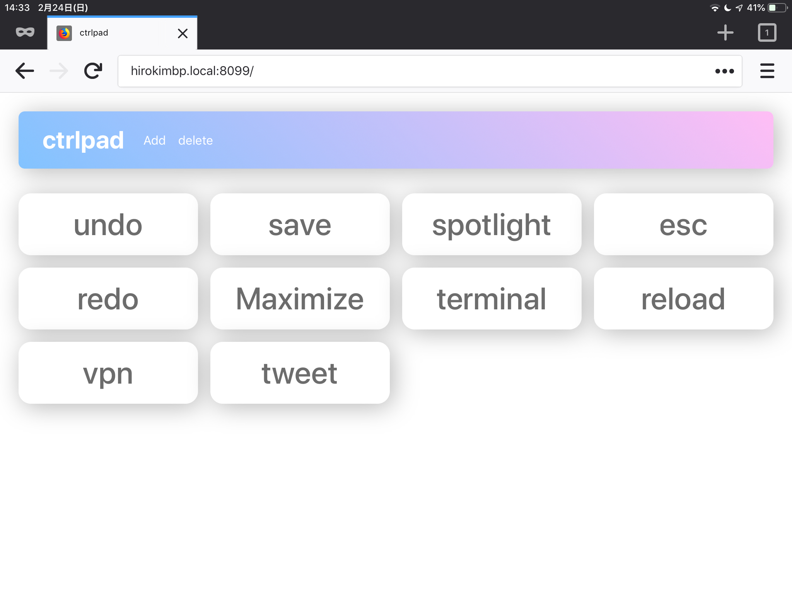

# ctrlpad

Type hotkey from remote with web browser.


## Launch

Type these command on host machine (now just support only macOS)

```bash
pip3 install -r requirements.txt  # install requirements
python3 ctrlpad.py  # launch server
```

and, type `[ip address]:8099` to your browser's address bar.